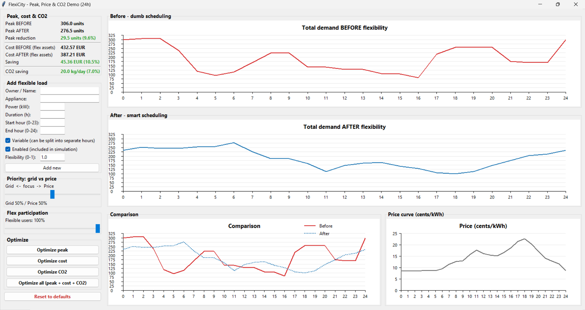
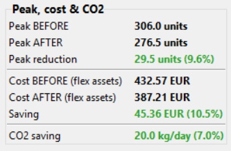
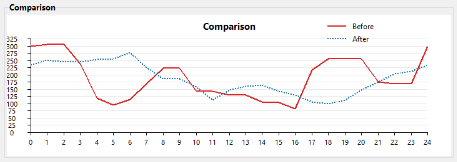
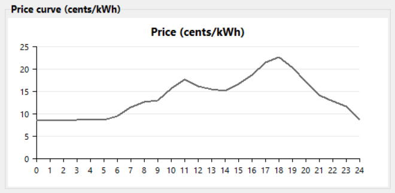

# FlexiCity

A 24-hour electricity load-shifting simulator. At default settings it flattens a modelled Nordic city's evening peak by 9.6% and cuts daily electricity cost on the modelled flex assets by 10.5%, by shifting EV charging, heat pumps, HVAC, and supermarket refrigeration into the cheap, clean midday hours.



Built in two days for **Urban Circular Hack Helsinki 2025** (U!REKA European University hackathon), team of three. The challenge was *"how do we prepare cities for the increasing demand in electricity"* and the angle we took was that you can get a lot of headroom without building new grid, just by being smarter about *when* big loads run.

## Results at default settings

100% flex participation, 50/50 grid-vs-price priority, 24 modelled assets:

| Metric                | Naive baseline | Smart schedule | Saving             |
|-----------------------|----------------|----------------|--------------------|
| Peak demand           | 306.0 kW       | 276.5 kW       | 29.5 kW (9.6%)     |
| Daily flex-asset cost | €432.57        | €387.21        | €45.36 (10.5%)     |

These are model outputs on the 24 fictional assets in the demo, not measurements on a real city. The four built-in optimisers push every one of these numbers further.





Red is the naive baseline, dashed blue is the smart schedule. The optimiser clips the evening peak (hours 17 to 21) and refills the cheap, clean midday valley.

## What I worked on

On the team I owned the scheduling algorithm, the four optimisers, the city load model, and the data inputs.

**The scheduler** runs in two passes. The "before" pass is the naive baseline, where every asset starts at the first hour it is allowed to. The "after" pass is the smart schedule: I process assets largest-first (so big loads pick the least-stressed hours first), score every hour by a weighted blend of grid load and electricity price, and place the asset at the lowest-scoring hours. After each placement the demand curve is updated, so smaller loads re-score against the new state and don't pile on top of each other.

Variable loads (EV charging, data-centre batteries, ventilation) can be split across non-contiguous hours. Fixed loads (a bakery oven, sauna heaters, a hospital laundry batch) have to run in one continuous block, so for those the optimiser slides a window of the required duration across the allowed range and picks the best position.

**The four optimisers** (peak demand, daily cost, CO₂, and a combined one) each run an exhaustive 1%-by-1% grid search across the two policy sliders, 10,201 schedules per run. The combined optimiser has a guardrail I added after noticing that an equal-weighted average would happily accept a small cost regression for a big peak win: any schedule where any metric loses against the naive baseline is rejected outright. No metric is allowed to lose.

**The city model** is 24 flexible loads (EV fleets, office HVAC pre-cooling, apartment-block heat pumps, supermarket and small-shop refrigeration, hospital laundry, tram and bus depots, data centres, metro and school ventilation, public chargers, swimming-pool water heating, sauna heaters), each parameterised with a rated power, duty-cycle duration, allowed operating window, and a flexibility factor that captures how much of the load is shiftable without compromising service.

**The data** is hourly Nord Pool spot prices collected from the Helen utility website in November 2025, plus a CO₂ intensity profile that follows the Nordic grid mix (clean midday from solar, hydro and nuclear, dirtier evening from thermal backup).



Hourly Nord Pool spot prices for the Helsinki bidding zone, recorded from the Helen website in November 2025. This is the curve the cost-focused optimiser is chasing.

## Why it matters

Peak electricity consumption in Espoo rose 46% between January 2023 and January 2024, and Caruna projects a 179% rise in peak power demand in their Espoo grid area by 2030 (source: City of Espoo). Building more grid is slow and expensive. Shifting flexible loads in time is a cheaper lever, and most large city loads don't actually need to run *right now* — an EV plugged in at 18:00 just needs to be full by morning, a defrost cycle doesn't care whether it runs at 19:00 or 03:00, a data-centre battery backup can charge whenever the grid has room.

## What I cut from scope

- One-day horizon. No inter-day storage, no state-of-charge carryover, no weather forecast.
- Each asset is modelled as constant rated power for its duty-cycle duration, not as a thermodynamic system. The project is a scheduling exercise on top of mechanical equipment, not a heat-transfer simulation. I assume that shifting a load inside its allowed window does not break operational or thermal constraints.
- Prices are a one-day snapshot, not a live feed.
- Single shared bus. No distribution-network or substation-level congestion.
- The optimiser is a greedy heuristic (largest-first, per-asset placement). A MILP solver would find globally better schedules but I did not have time to wire one up.

## What I'd build next

- Live price and CO₂ feeds (Nord Pool, Fingrid).
- Multi-day horizon so EV state-of-charge and heat-pump pre-heating can carry across days.
- MILP solver for global optimality instead of the greedy heuristic.
- Distribution-network modelling so the peak relief lands at the right substation.
- Forecast uncertainty — the current optimiser assumes the schedule executes perfectly, which it will not.

## Run it

Python 3 with `tkinter` (bundled with most installs). No external dependencies.

```bash
python Flexi_City.py
```

Drag the two sliders, click any of the four optimiser buttons, or add your own load through the form on the left.

## Hackathon details

Urban Circular Hack Helsinki 2025 (U!REKA European University hackathon), HXRC Arabia Campus, 24–25 November 2025. Partners: Metropolia UAS, City of Helsinki, City of Espoo, City of Vantaa, Helsinki-Uusimaa Regional Council.

**Team 7:** Robert Winiarczyk, Dimitrios Pontikakis Batana, Ailikuti Tayier.

## Sources

- *Towards Climate-Neutral Espoo 2030*, Elina Wanne, City of Espoo (peak power figures via Caruna).
- *Energy Solutions as part of Strategic Urban Planning*, Alpo Tani, City of Helsinki.
- Nord Pool spot prices, Helen website, November 2025.
- Fingrid hourly CO₂ intensity, used as a Nordic mix proxy.

MIT license.
